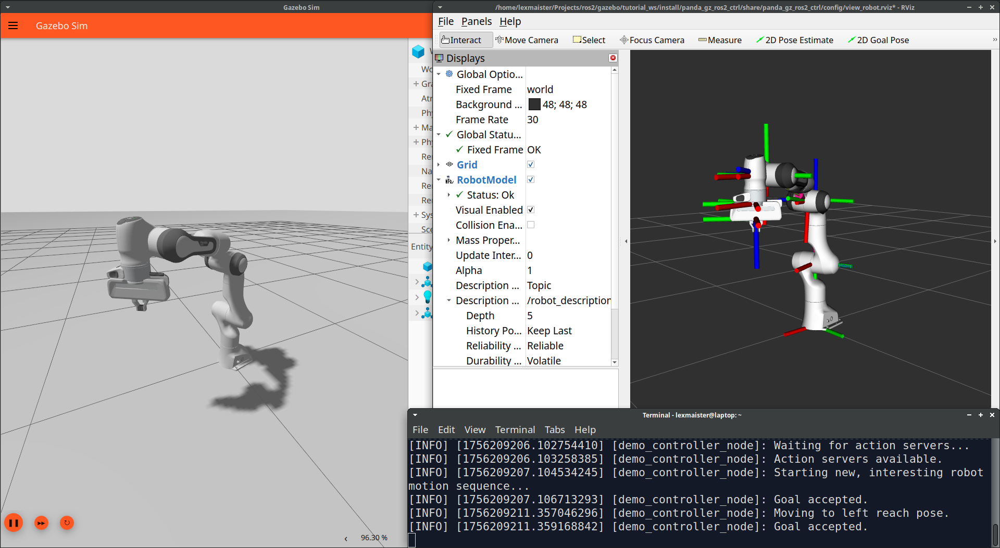

# Gazebo Tutorial: Controlling a Panda Arm in Gazebo with `ros2_control`

## Introduction

This example package demonstrates how to control a Panda manipulator in Gazebo Sim using the `ros2_control` framework. It serves as the bridge between a static robot model and a dynamically controllable system, which is the foundation for all advanced robotics tasks.

This tutorial will guide you through the complete process:

- **Configuration:** Setting up the URDF with `ros2_control` plugins and defining controllers in YAML.
- **Simulation:** Launching the entire stack, including Gazebo, RViz, and all necessary ROS nodes.
- **Interaction:** Commanding the robot's joints manually from the command line for testing and debugging.
- **Automation:** Running a Python script to execute a complex, pre-programmed sequence of motions.

## Prerequisites

- You have a ROS 2 distribution (e.g., Jazzy) with Gazebo and developer tools installed.
- You have successfully completed the previous tutorials in this series.
- You have installed the necessary `ros2_control` and Gazebo integration packages. Note the use of `$ROS_DISTRO` to automatically adapt to your ROS 2 version:
  
```bash
sudo apt update
source /opt/ros/<YOUR-DISTRO>/setup.bash # change <YOUR-DISTRO> to your version, e.g. humble, jazzy
sudo apt install ros-$ROS_DISTRO-ros2-control ros-$ROS_DISTRO-ros2-controllers ros-$ROS_DISTRO--gz-ros2-control ros-$ROS_DISTRO--gz-ros2-control-demos
```

## Key Concepts: The ros2_control Architecture

The framework connects controllers to hardware (or a simulation) via a standard interface model. It's helpful to think of this as a Provider/Consumer relationship.

### The URDF: The Hardware "Provider"

The URDF [panda.urdf.xacro](./panda_gz_ros2_ctrl/panda_description/urdf/panda.urdf.xacro) defines the physical robot and also declares the "hardware interfaces" it makes available. In simulation, the gz_ros2_control/GazeboSimSystem plugin acts as our virtual hardware. We add a <ros2_control> tag to specify which joints can be controlled and what data they provide:

```xml
<ros2_control name="GazeboSimSystem" type="system">
    <hardware>
        <plugin>gz_ros2_control/GazeboSimSystem</plugin>
    </hardware>

    <!-- Example for a single arm joint -->
    <joint name="panda_joint1">
        <!-- This joint can be commanded via position -->
        <command_interface name="position"/>
        <!-- This joint provides its position, velocity, and effort as feedback -->
        <state_interface name="position"/>
        <state_interface name="velocity"/>
        <state_interface name="effort"/>
    </joint>
    <!-- ... all 7 arm joints are defined similarly ... -->

    <!-- Example for the gripper, where one joint mimics another -->
    <joint name="panda_finger_joint1">
        <command_interface name="position"/>
        <state_interface name="position"/>
    </joint>
    <joint name="panda_finger_joint2">
        <!-- The mimic joint ONLY provides state, it cannot be commanded directly -->
        <state_interface name="position"/>
    </joint>
</ros2_control>
```

### YAML: The Controller "Consumer"

The controller configuration file [controller.yaml](./panda_gz_ros2_ctrl/config/controller.yaml) defines which controllers we want to use and which of the "provided" interfaces they will "consume" to do their job:

```yaml
controller_manager:
  ros__parameters:
    update_rate: 1000  # Hz

# This special controller reads ALL state interfaces and publishes them to /joint_states
joint_state_broadcaster:
  ros__parameters:
    type: joint_state_broadcaster/JointStateBroadcaster

# This controller "consumes" the 7 arm joints
panda_arm_controller:
  ros__parameters:
    type: joint_trajectory_controller/JointTrajectoryController
    joints:
      - panda_joint1
      - panda_joint2
    ...

# This controller "consumes" only the single actuated gripper joint
panda_hand_controller:
  ros__parameters:
    type: joint_trajectory_controller/JointTrajectoryController
    joints:
      - panda_finger_joint1
    ...
```

## Building and Launching the Full Simulation

Create a workspace:

```sh
mkdir -p tutorial_ws/src
cd tutorial_ws/src
```

Download package code into it:

- Go to: [GitHub Download Directory](https://download-directory.github.io/)
- Paste pkg address `https://github.com/lexmaister/gazebo_tutorial/tree/main/05_ros2_control/panda_gz_ros2_ctrl` and click `Download`
- Unpack zip to `tutorial_ws/src` (example):

```sh
unzip ~/Downloads/lexmaister\ gazebo_tutorial\ main\ 05_ros2_control-panda_gz_ros2_ctrl.zip -d panda_gz_ros2_ctrl
```

Source ROS2 and build the package:

```sh
cd ..
colcon build --symlink-install
```

Source the environment and run `main` launch file

```sh
source install/setup.bash
ros2 launch panda_gz_ros2_ctrl main.launch.py
```

You should see the Panda robot in its upright "park" pose in both the Gazebo and RViz windows.

It is also possible to launch with debug logger level:

```sh
ros2 launch panda_gz_ros2_ctrl main.launch.py logger_level:=debug
```

## Manual Interaction

With the simulation running, we can use command-line tools to test our controllers. You need another terminal with sourced ROS2:

```sh
source /opt/ros/<YOUR-DISTRO>/setup.bash # change <YOUR-DISTRO> to your version, e.g. humble, jazzy
```

### Controlling the Gripper

Send a goal to the `panda_hand_controller` to open the gripper. The value `0.04` corresponds to the joint's upper limit we use slightly lower range here:

```sh
ros2 action send_goal /panda_hand_controller/follow_joint_trajectory control_msgs/action/FollowJointTrajectory '{
  "trajectory": {
    "joint_names": ["panda_finger_joint1"],
    "points": [
      {
        "positions": [0.035],
        "time_from_start": {"sec": 2, "nanosec": 0}
      }
    ]
  }
}'
```

Send the goal to close it. It's normal, that gripper won't close. The issue is in PID controller settings - that will be cover in the next tutorials.

```sh
ros2 action send_goal /panda_hand_controller/follow_joint_trajectory control_msgs/action/FollowJointTrajectory '{
  "trajectory": {
    "joint_names": ["panda_finger_joint1"],
    "points": [
      {
        "positions": [0.00],
        "time_from_start": {"sec": 2, "nanosec": 0}
      }
    ]
  }
}'
```

### Controlling the Arm

Similarly, we command the panda_arm_controller. We must specify all 7 joints and their target positions.

```sh
ros2 action send_goal /panda_arm_controller/follow_joint_trajectory control_msgs/action/FollowJointTrajectory '{
  "trajectory": {
    "joint_names": [
      "panda_joint1", "panda_joint2", "panda_joint3", "panda_joint4",
      "panda_joint5", "panda_joint6", "panda_joint7"
    ],
    "points": [
      {
        "positions": [0.5, 0.2, 0.0, -1.2, 0.0, 1.4, 0.0],
        "time_from_start": {"sec": 4, "nanosec": 0}
      }
    ]
  }
}'
```

And then we can move the arm to the park position:

```sh
ros2 action send_goal /panda_arm_controller/follow_joint_trajectory control_msgs/action/FollowJointTrajectory '{
  "trajectory": {
    "joint_names": [
      "panda_joint1", "panda_joint2", "panda_joint3", "panda_joint4",
      "panda_joint5", "panda_joint6", "panda_joint7"
    ],
    "points": [
      {
        "positions": [0.0, -0.785, 0.0, -2.356, 0.0, 1.571, 0.785],
        "time_from_start": {"sec": 4, "nanosec": 0}
      }
    ]
  }
}'
```

### Monitoring Joint States

To see the "ground truth" data from the simulation, you can "echo" the /joint_states topic. This is invaluable for seeing if a joint is truly stuck or just moving very little.

```sh
ros2 topic echo /joint_states sensor_msgs/msg/JointState
```

Example message contains all joints' data:

```text
header:
  stamp:
    sec: 118
    nanosec: 438000000
  frame_id: ''
name:
- panda_finger_joint1
- panda_finger_joint2
- panda_joint1
- panda_joint2
- panda_joint3
- panda_joint4
- panda_joint5
- panda_joint6
- panda_joint7
position:
- -7.858032258743763e-13
- -4.3655644420617645e-14
- 3.345305401580845e-07
- -0.7849834561347961
- 5.4490010370500386e-06
- -2.355966806411743
- -7.3978371801786125e-06
- 1.570957899093628
- 0.7849934697151184
velocity:
- 0.0
- 0.0
- 0.0
- 2.9793009161949158e-05
- 1.8917489796876907e-10
- 0.00011914223432540894
- 0.0
- -4.76837158203125e-05
- -2.384185791015625e-05
effort:
- 0.054768227306226436
- -1.7486450815340504e-05
- -0.17536401748657227
- -3.3343059420585632
- -6.135307312011719
- -15.096150875091553
- 0.21683472394943237
- 2.213101863861084
- 0.015369687242269947
---
```

### Live PID Tuning

If a controller is misbehaving (as it cannot close gripper), you can adjust its PID gains live without restarting the simulation.

```sh
ros2 param set /controller_manager panda_hand_controller.gains.panda_finger_joint1.p 100.0
```

## Programmatic Control with a Python Node

The ultimate goal is automation. The [demo_control.py](./panda_gz_ros2_ctrl/panda_gz_ros2_ctrl/demo_control.py) node provides an example of programmatic control using the rclpy action client to chain a sequence of motions. While simulation is running, we may run it in another terminal:

```sh
cd tutorial_ws
source /opt/ros/<YOUR-DISTRO>/setup.bash # change <YOUR-DISTRO> to your version, e.g. humble, jazzy
source install/setup.bash
ros2 run panda_gz_ros2_ctrl demo_control
```

The robot will automatically execute a sequence of motions:

- Start at Park
- Move to Reach Left -> Reach Right -> High Pose -> Pickup Pose
- Open and Close the gripper
- Return to Park



## Troubleshooting Common Issues

- **"Controller 'type' param not defined" Error**: The controller.yaml file was not loaded. Ensure your main.launch.py correctly passes the controller parameters to the gz_sim process.
- **Gripper Opens But Won't Close**: This is a classic symptom of the gripper's collision mesh "jamming" against the hand at its joint limit. The fix is to slightly shrink the finger collision boxes in the URDF to create a physical clearance.
- **Joint "Tries to Move but Fails"**: The controller's force is not enough to overcome the simulation's physics (damping and friction). The best solution is to reduce or eliminate the `<dynamics damping="...">` and Gazebo friction properties for that joint in the URDF or adjusting PID controller parameters.
- **Robot Collapses on Startup**: The initial_value for the joints in the URDF's <ros2_control> tag is not a gravitationally stable pose. Adjust these values to a stable starting configuration.

## Video

<!-- [](https://www.youtube.com/watch?v=fmhGUUFOLGU) -->

## References

- [`ros2_control` package documentation (jazzy)](https://control.ros.org/jazzy/doc/ros2_control/doc/index.html)
- [`gz_ros2_control` package documentation (jazzy)](https://github.com/ros-controls/gz_ros2_control/blob/jazzy/doc/index.rst)
- [General Gazebo Tutorials Collection](https://github.com/lexmaister/gazebo_tutorial)
